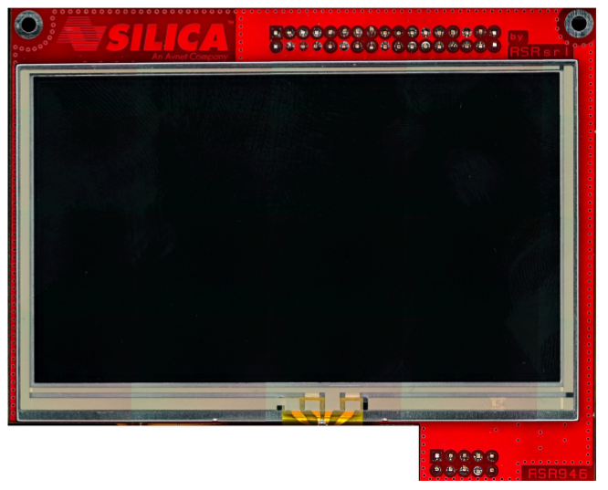
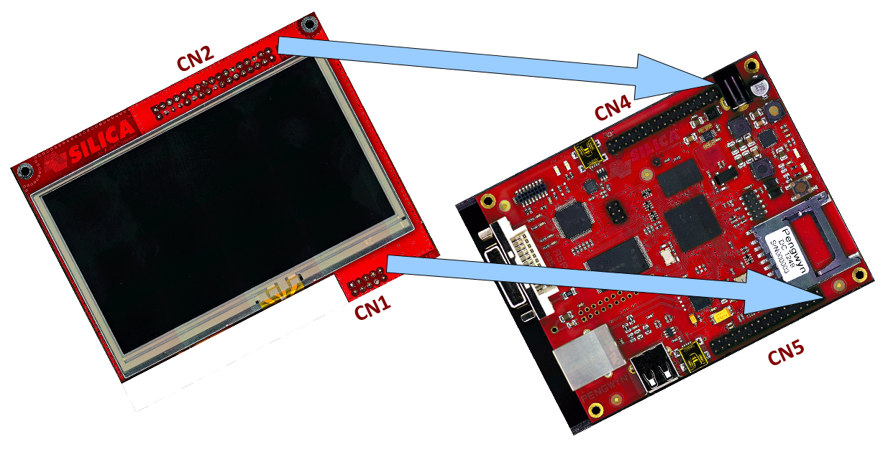

Touch Screen
============

This procedure will guide you to the installation of the display on the Pengwyn board and the configuration of the software to test it.

Installing the board
--------------------

1. switch off the board

2. connect display

3. switch on the board without SD card

Installing the software
-----------------------

If you don't have a SD card formatted with 2 partitions, one for the boot and one for the root filesystem, create it as in :ref:`Deploy <quick_deploy_rootfs_label>`. Now we want install in rootfs the qt4e-demo-image-@machine-name@.tar.gz image.

.. host::

 | sudo tar -zxf ~/architech_sdk/architech/@board-alias@/yocto/tmp/deploy/images/@machine-name@/qt4e-demo-image-@machine-name@.tar.gz -C /path/to/sdcard/rootfs

And substitute the pengwyn.dtb with this one:

.. host::

 | sudo cp ~/architech_sdk/architech/@board-alias@/yocto/tmp/deploy/images/@machine-name@/zImage-pengwyn-touch.dtb /path/to/sdcard/boot/pengwyn.dtb

Make sure everything has been really written to the SD card:

.. host::

 | sync

Then insert SD card on Pengwyn board and wait Linux start-up. First time, **the touch screen calibration is needed**, than qt4 demo will start.

